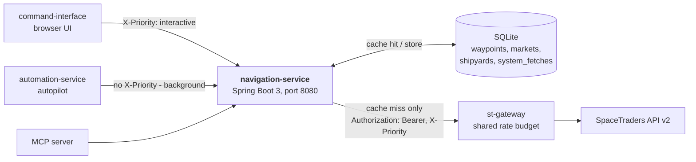
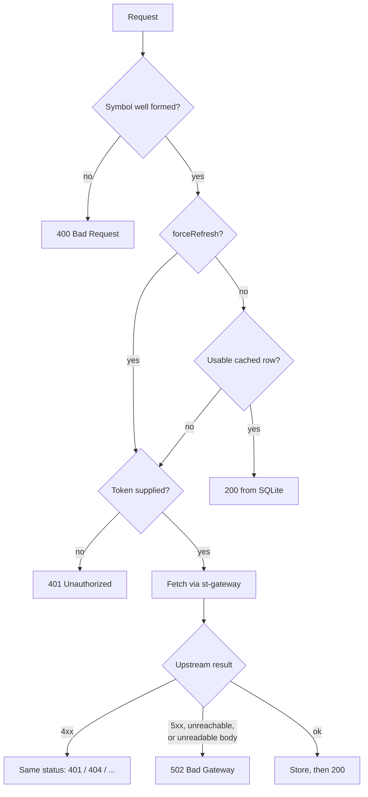
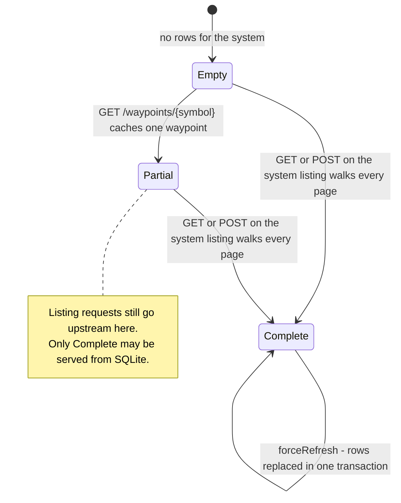

# Navigation Service

A read-through cache for the parts of the SpaceTraders universe that barely change.

Waypoints, shipyards and markets are read constantly — by the browser UI drawing a system
map, and by the autopilot planning routes — but SpaceTraders enforces a rate budget the
whole fleet shares through **st-gateway**. Spending that budget re-fetching a waypoint
whose coordinates have not moved since the universe was generated is the problem this
service exists to remove. It stores what it fetches in SQLite and serves it back without
touching the budget again.

Two consequences follow from that, and they explain most of the design:

- **Reads are public.** A cache hit needs no credential, so anything in the fleet can read
  a known waypoint without holding a SpaceTraders token. Only a *live fetch* needs one.
- **Nothing expires by default.** Waypoints and shipyards are kept until a caller
  explicitly asks for a refresh. Markets are the exception: prices move, so they carry a
  short TTL.

Java 21 / Spring Boot 3 / SQLite. Rewritten from an earlier Kotlin/Ktor/MongoDB service.

---

## Architecture



The service never calls SpaceTraders directly. Every upstream request goes through
st-gateway, which owns the rate budget and a priority queue, and this service forwards the
caller's own priority declaration rather than asserting one of its own.

## The read path

Every endpoint follows the same shape. The only credential check happens on the branch
that actually needs a credential.



"Usable cached row" differs per resource, and that is the whole of the cache policy:

| Resource  | Cached row is usable when                        | Refreshed by                             |
|-----------|--------------------------------------------------|------------------------------------------|
| Waypoint  | it exists                                        | `forceRefresh=true` or the refresh route |
| Shipyard  | it exists                                        | `forceRefresh=true` or the refresh route |
| Market    | it exists **and** is younger than the market TTL | the TTL expiring, or an explicit refresh |
| System listing | a *complete* walk of that system is recorded | `forceRefresh=true` or the refresh route |

### Why a system listing is special

A row in `waypoints` may have arrived from a single-waypoint lookup, which says nothing
about whether the rest of the system is cached. So a completed walk of a system is recorded
separately, in `system_fetches`, and only that marker lets the listing endpoint answer from
disk.



The replacement in the `Complete` state is transactional: the delete of the old rows, the
insert of the new ones and the marker update either all land or none do.

## Authentication

There is no session or API key on this service. Endpoints take one optional header:

| Header                 | Required | Meaning                                                                 |
|------------------------|----------|-------------------------------------------------------------------------|
| `X-SpaceTraders-Token` | no       | Bare SpaceTraders token. Forwarded upstream as `Bearer`; never stored.   |
| `X-Priority`           | no       | `interactive` for user-facing traffic; anything else means `background`. |

The token is deliberately **not** in `Authorization` — the rest of the fleet reserves that
header for a Clerk session. Without a token a request is served from cache or answered
`401`; it is never rejected up front.

`X-Priority` is forwarded to st-gateway's queue. Anything that is not exactly
`interactive` — missing, misspelled, invented — degrades to `background`, so no caller can
jump the queue that keeps the browser responsive by sending a malformed header.

---

## Running it

Requirements: Java 21+. The Gradle wrapper is included.

```bash
./gradlew bootRun          # http://localhost:8080
./gradlew test             # tests only
./gradlew build            # compile, test, and build the executable jar
```

The SQLite file and its parent directory are created on first run.

Upstream calls need st-gateway on `ST_GATEWAY_URL` (default `http://localhost:3002`).
Without it the service still starts and still serves everything already cached; live
fetches answer `502`.

### Configuration

| Environment variable  | Default                 | Description                                            |
|-----------------------|-------------------------|--------------------------------------------------------|
| `SQLITE_DB_PATH`      | `./data/navigation.db`  | SQLite file. Parent directory is created if missing.    |
| `SERVER_PORT`         | `8080`                  | HTTP port.                                              |
| `ST_GATEWAY_URL`      | `http://localhost:3002` | st-gateway base URL; `/proxy` is appended.              |
| `MARKET_CACHE_TTL`    | `60s`                   | Market cache lifetime. `0s` disables market caching.    |
| `CORS_ALLOWED_ORIGIN` | `http://localhost:3000` | Comma-separated browser origins allowed on `/api/**`.   |

### Container

`.github/workflows/container.yml`:

| Trigger                    | What runs                                                     |
|----------------------------|---------------------------------------------------------------|
| `pull_request` → `main`    | `./gradlew test`                                              |
| `push` → `main`, tags `v*` | Build and push `linux/amd64` + `linux/arm64` image, then SSM redeploy |

Images are `ghcr.io/v-m-pioneer-trading/navigation-service:latest` and
`:sha-<full_commit_sha>`. `latest` is only tagged on the default branch.

```bash
docker run -d --name navigation-service --restart unless-stopped \
  -p 8080:8080 \
  -e SQLITE_DB_PATH=/data/nav.db \
  -e ST_GATEWAY_URL=http://st-gateway:3002 \
  -e SPRING_PROFILES_ACTIVE=prod \
  -v nav-data:/data \
  ghcr.io/v-m-pioneer-trading/navigation-service:latest
```

---

## API

Interactive docs at `GET /swagger-ui.html`, spec at `GET /api-docs`.

| Method | Path                                                  | Description                                    |
|--------|-------------------------------------------------------|------------------------------------------------|
| `GET`  | `/health`, `/api/navigation/health`                    | Liveness. Unauthenticated, unversioned.        |
| `GET`  | `/api/navigation/v1/waypoints/{symbol}`                | One waypoint.                                  |
| `POST` | `/api/navigation/v1/waypoints/{symbol}/refresh`        | Re-fetch that waypoint.                        |
| `GET`  | `/api/navigation/v1/systems/{systemSymbol}/waypoints`  | Every waypoint in a system.                    |
| `POST` | `/api/navigation/v1/systems/{systemSymbol}/waypoints/refresh` | Re-walk the system.                     |
| `GET`  | `/api/navigation/v1/waypoints/{symbol}/market`         | Market data. TTL applies.                      |
| `POST` | `/api/navigation/v1/waypoints/{symbol}/market/refresh` | Re-fetch market data.                          |
| `GET`  | `/api/navigation/v1/waypoints/{symbol}/shipyard`       | Shipyard data.                                 |
| `POST` | `/api/navigation/v1/waypoints/{symbol}/shipyard/refresh` | Re-fetch shipyard data.                      |

Every `GET` above accepts `?forceRefresh=true`, which is exactly equivalent to calling the
matching `POST .../refresh`.

```bash
# Cached read, no credential needed
curl http://localhost:8080/api/navigation/v1/waypoints/X1-FQ86-B29

# Live fetch, interactive priority
curl -H "X-SpaceTraders-Token: $ST_TOKEN" -H "X-Priority: interactive" \
     "http://localhost:8080/api/navigation/v1/systems/X1-FQ86/waypoints?forceRefresh=true"
```

Single resources return the raw SpaceTraders object. System listings wrap it:

```json
{ "data": [ { "symbol": "X1-FQ86-B29", "type": "ASTEROID", "...": "..." } ], "total": 24 }
```

`total` is the number of waypoints in this response, not SpaceTraders' page count.

### Errors

[RFC 9457 problem details](https://www.rfc-editor.org/rfc/rfc9457), `application/problem+json`.

| Status | When                                                                              |
|--------|-----------------------------------------------------------------------------------|
| `400`  | Malformed waypoint or system symbol.                                              |
| `401`  | SpaceTraders rejected the token, **or** nothing was cached and no token was sent.  |
| `404`  | Waypoint, system, market or shipyard not found upstream.                          |
| `502`  | st-gateway unreachable, upstream 5xx, or a response this service could not read.   |
| `500`  | A cached row that can no longer be parsed. Refresh the resource to clear it.       |

---

## Known limitations

- **No TTL on waypoints or shipyards.** If SpaceTraders ever mutates one — construction
  completing, a new shipyard appearing — the cached copy is wrong until someone refreshes
  it. Callers that care must pass `forceRefresh=true`.
- **A system listing is all-or-nothing.** There is no partial fill: the first listing
  request for a system walks every page before answering, which on a large system is
  several upstream calls in one request.
- **Single writer.** The Hikari pool is fixed at one connection because SQLite tolerates
  concurrent writers poorly. Under load, writes serialise; a slow refresh blocks other
  writes.
- **No coalescing of concurrent misses.** Two simultaneous requests for the same uncached
  waypoint both call upstream.
- **The system-completeness marker does not survive a schema-less migration.** A database
  from before `system_fetches` existed has waypoint rows but no markers, so the first
  listing per system after upgrading re-walks that system once. This is correct, just not
  free.
- **`markets` and `shipyards` are never evicted.** Nothing prunes rows; the file grows with
  the number of distinct waypoints ever visited.
- **The container runs as root** and writes to a root-owned volume. Changing this needs a
  coordinated `chown` of existing deployment volumes, so it has not been done.
- **CI does not build the image on pull requests** — only tests run. A Dockerfile-only
  change is not verified until it reaches `main`.

## Related services

- **st-gateway** — owns the SpaceTraders rate budget and the `interactive`/`background`
  priority queue. All upstream traffic goes through it.
- **SpaceTraders API** — `GET /systems/{system}/waypoints/{waypoint}`,
  `GET /systems/{system}/waypoints` (paginated, 20 per page),
  plus the `/market` and `/shipyard` sub-resources.
  [Docs](https://spacetraders.stoplight.io/docs/spacetraders/11f2735b75b02-space-traders-api).

Contributing to this service? See [CLAUDE.md](CLAUDE.md) for the module map, invariants and
testing harness.
