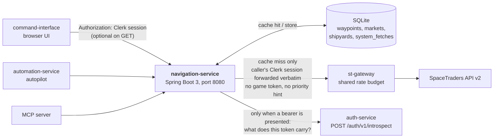
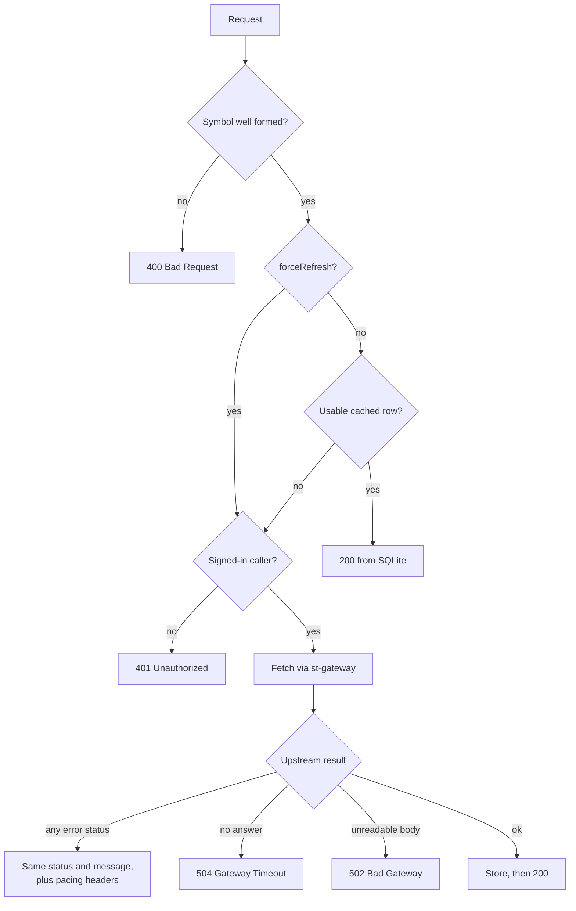
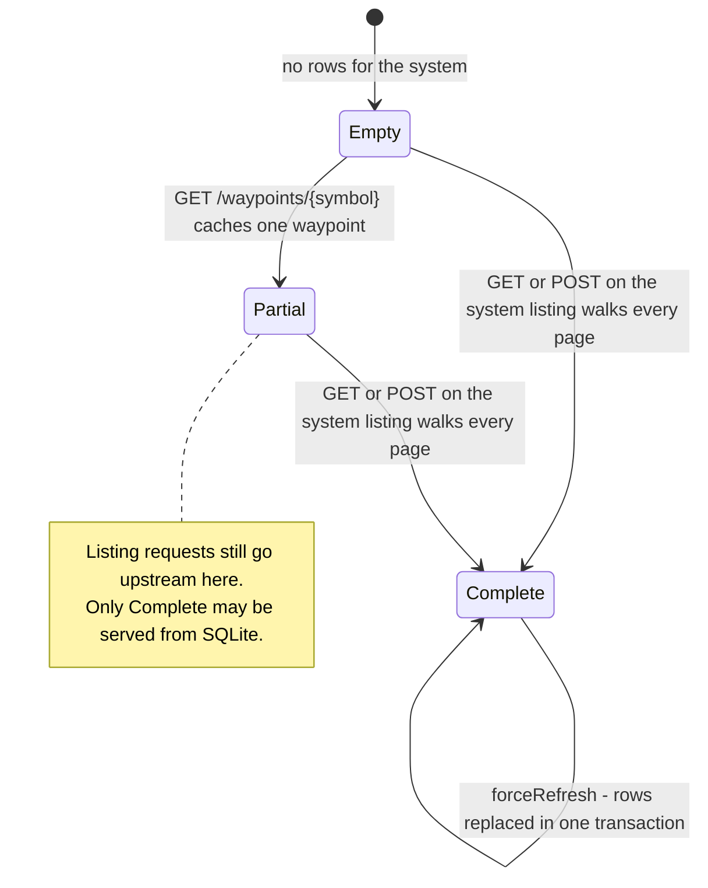

# Navigation Service

A read-through cache for the parts of the SpaceTraders universe that barely change.

Waypoints, shipyards and markets are read constantly — by the browser UI drawing a system
map, and by the autopilot planning routes — but SpaceTraders enforces a rate budget the
whole fleet shares through **st-gateway**. Spending that budget re-fetching a waypoint
whose coordinates have not moved since the universe was generated is the problem this
service exists to remove. It stores what it fetches in SQLite and serves it back without
touching the budget again.

Two consequences follow from that, and they explain most of the design:

- **Reads are public.** A cache hit needs no identity at all, so anything in the fleet can
  read a known waypoint anonymously. Only a *live fetch* needs a signed-in caller, and only
  an explicit *refresh* needs the `universe:refresh` scope.
- **Nothing expires by default.** Waypoints and shipyards are kept until a caller
  explicitly asks for a refresh. Markets are the exception: prices move, so they carry a
  short TTL.

Java 21 / Spring Boot 3 / SQLite. Rewritten from an earlier Kotlin/Ktor/MongoDB service.

---

## Architecture



The service never calls SpaceTraders directly. Every upstream request goes through
st-gateway, which owns the rate budget, injects the fleet's agent token itself
(auth-design.md decision 5) and derives queue priority from the identity it verifies
(decision 2).

That last part is why an outbound request carries the caller's `Authorization` header,
byte for byte, exactly as it arrived: st-gateway establishes the caller's identity from
those bytes for itself and puts a human operator's call in the `interactive` queue and
everything else in `background`. A backend that verified the session and then forwarded
nothing would silently drop every one of its calls into `background` — no error, just a
dashboard waiting behind the autopilot. Nothing a caller sends can be *spoofed* into a
promotion, because the gateway trusts a verified identity rather than the fact that a
header arrived.

An anonymous caller has no session to forward, so its request goes out bare and lands in
`background`, which is the correct lane for it.

## The read path

Every endpoint follows the same shape. The only identity check happens on the branch
that actually spends the rate budget.



"Usable cached row" differs per resource, and that is the whole of the cache policy:

| Resource  | Cached row is usable when                        | Refreshed by                             |
|-----------|--------------------------------------------------|------------------------------------------|
| Waypoint  | it exists                                        | `forceRefresh=true` or the refresh route |
| Shipyard  | it exists                                        | `forceRefresh=true` or the refresh route |
| Market    | it exists **and** is younger than the market TTL | the TTL expiring, or an explicit refresh |
| System listing | a *complete* walk of that system is recorded | `forceRefresh=true` or the refresh route |

### Why a system listing is special

A row in `waypoints` may have arrived from a single-waypoint lookup, which says nothing
about whether the rest of the system is cached. So a completed walk of a system is recorded
separately, in `system_fetches`, and only that marker lets the listing endpoint answer from
disk.



The replacement in the `Complete` state is transactional: the delete of the old rows, the
insert of the new ones and the marker update either all land or none do.

## Authentication

This service verifies no token itself. When a request carries a bearer token it asks
**auth-service** what that token carries — `POST /auth/v1/introspect`, shaped after
RFC 7662 — and decides only what its own route needs (auth-design.md decision 21,
meta#80 step 7). Before that it verified Clerk JWTs locally against `CLERK_JWT_KEY`; that
code, and the `nimbus-jose-jwt` dependency, are gone.

Every handler declares what it needs, on the handler method, in the fleet's vocabulary:

| Route | Declaration | No `Authorization` header | Bearer token presented |
|-------|-------------|---------------------------|------------------------|
| `GET /api/navigation/v1/…` (4 reads) | `@AllowPublic` | visitor; cache only, a miss is `401`; auth-service **not** asked | auth-service asked; the verified session may live-fetch on a miss |
| `POST /api/navigation/v1/…/refresh` (4 refreshes) | `@RequireScope("universe:refresh")` | `401` | auth-service asked; `403` without the scope |
| `GET /health`, `GET /api/navigation/health` | `@IgnoreCredentials` | answers | header never read, auth-service never asked |
| `GET /api-docs`, Swagger UI | ignore credentials (springdoc's own handlers) | answers | header never read |

The rules, in the order they are applied:

| Situation | Status | Message | auth-service asked |
|---|---|---|---|
| A mutating method on a route declaring no scope | `500` | `this route declares no required scope` | no |
| No `Authorization`, public read | — proceeds as a visitor | | no |
| No `Authorization`, or anything but exactly `Bearer <token>`, on a refresh | `401` | `a bearer token is required` | no |
| auth-service says `active: false` | `401` | `invalid or expired session` | yes |
| Active, but without `universe:refresh` on a refresh | `403` | `this action requires a scope this session does not carry` | yes |
| auth-service unreachable, slower than 1 s, non-2xx, unreadable, or rejecting our secret | `503` | `the authentication service could not process this request` | yes, once |

A presented token that does not verify is `401` on every route, public reads included — a
bad credential is never quietly downgraded to anonymous. `fleet:control` does not imply
`universe:refresh` (decision 20), and the `403` names no scope. `Bearer abc def`,
`Bearer `, a non-Bearer scheme and two `Authorization` lines are all *no credential*: a
visitor on a read, `401` on a refresh, and auth-service is not asked.

**Every handler must declare.** At startup the service walks every route Spring MVC can
dispatch to and refuses to start if one carries no declaration, more than one, or declares
a read-only intent (`@AllowPublic`, `@IgnoreCredentials`) on a mutating method; the
message names the mapping and the handler. An undeclared handler is never read as
"public". At request time the same rule answers `500` for anything the walk could not see.

How Spring's own dispatch lines up with the fleet's rules:

- **`HEAD`** is dispatched by Spring to the `GET` handler of the same path, so it carries
  that handler's declaration: a visitor on a public read, a `401` on a guarded one.
- **`OPTIONS`** on a path whose handlers do not map it is answered by Spring itself, with
  an `Allow` header and no handler run; it is declared public, so a visitor proceeds and a
  bad token is still a `401`. A handler that maps `OPTIONS` explicitly is governed by its
  own declaration. The path's existence and methods are disclosed this way, as Express
  discloses them.
- **CORS preflights** are terminated by Spring's CORS handling (`CorsConfig`); no
  controller runs and no header is read.
- A **trailing slash**, a **case-variant path** or an unknown path matches no handler at
  all and is a plain `404`; Spring Boot's catch-all static-resource handler is switched
  off so nothing else answers it.

Auth failures use the fleet-wide `{"error":{"message":…}}` envelope with the same five
sentences as every other backend, so command-interface needs one parser for all of them.
This is the one place this service does not emit RFC 9457 problem details, and the
envelope is written before any controller runs, so the RFC 9457 handler never sees it.

A verified session is used twice: once here, to decide whether this caller may cause a
live fetch, and once again upstream, because the header it arrived on is forwarded to
st-gateway byte for byte so the gateway can pick the queue lane (decision 2). Only a header
auth-service vouched for is relayed; anything else reads as anonymous and is not passed on.

The behaviour is pinned by meta's `fixtures/introspection.json`, vendored into
`src/test/resources/introspection/` and driven case by case through the real interceptor
and HTTP client against a stub auth-service.

No SpaceTraders game credential is ever presented to this service: st-gateway holds the
only copy and injects it upstream (decision 5). The old `X-SpaceTraders-Token` and
`X-Priority` headers are gone; a stray one is ignored, never an error.

---

## Running it

Requirements: Java 21+. The Gradle wrapper is included.

```bash
./gradlew bootRun          # http://localhost:8080
./gradlew test             # tests only
./gradlew build            # compile, test, and build the executable jar
```

The SQLite file and its parent directory are created on first run.

Upstream calls need st-gateway on `ST_GATEWAY_URL` (default `http://localhost:3002`).
Without it the service still starts and still serves everything already cached; live
fetches answer `504`.

### Configuration

| Environment variable  | Default                 | Description                                            |
|-----------------------|-------------------------|--------------------------------------------------------|
| `SQLITE_DB_PATH`      | `./data/navigation.db`  | SQLite file. Parent directory is created if missing.    |
| `SERVER_PORT`         | `8080`                  | HTTP port.                                              |
| `ST_GATEWAY_URL`      | `http://localhost:3002` | st-gateway base URL; `/proxy` is appended.              |
| `MARKET_CACHE_TTL`    | `60s`                   | Market cache lifetime. `0s` disables market caching.    |
| `CORS_ALLOWED_ORIGIN` | `http://localhost:3000` | Comma-separated browser origins allowed on `/api/**`.   |
| `AUTH_INTROSPECTION_URL` | —                    | **Required.** The **full** introspection endpoint, `/auth/v1/introspect` included, POSTed to verbatim — never a base URL. Production: `http://localhost:3005/auth/v1/introspect`. |
| `AUTH_INTROSPECTION_SECRET` | —                 | **Required.** Sent as `X-Introspection-Secret`. Never the vault's `AUTH_SERVICE_SHARED_SECRET`. |

Without either introspection variable the service refuses to start, naming the one that
is missing; there is no auth-optional mode. `CLERK_JWT_KEY`, `CLERK_JWT_KEY_FILE` and
`CLERK_ISSUER` are no longer read — a deployment may keep setting them (the stack does,
for rollback, until meta#80 step 10) and they change nothing.

Locally, point it at a running auth-service, e.g.
`AUTH_INTROSPECTION_URL=http://localhost:3005/auth/v1/introspect` and the secret your
compose file gives auth-service.

### Container

`.github/workflows/container.yml`:

| Trigger                    | What runs                                                     |
|----------------------------|---------------------------------------------------------------|
| `pull_request` → `main`    | `./gradlew test`                                              |
| `push` → `main`, tags `v*` | Build and push a `linux/arm64` image on a native arm64 runner (the host is Graviton); SSM redeploy only for the tip of `main` |

Images are `ghcr.io/v-m-pioneer-trading/navigation-service:latest` and
`:sha-<full_commit_sha>`. `latest` is only tagged on the default branch. The
images are `linux/arm64` only (the host is Graviton); on an x86 machine, build
locally instead of pulling.

```bash
docker run -d --name navigation-service --restart unless-stopped \
  -p 8080:8080 \
  -e SQLITE_DB_PATH=/data/nav.db \
  -e ST_GATEWAY_URL=http://st-gateway:3002 \
  -e SPRING_PROFILES_ACTIVE=prod \
  -e AUTH_INTROSPECTION_URL=http://auth-service:3005/auth/v1/introspect \
  -e AUTH_INTROSPECTION_SECRET="$AUTH_INTROSPECTION_SECRET" \
  -v nav-data:/data \
  ghcr.io/v-m-pioneer-trading/navigation-service:latest
```

---

## API

Interactive docs at `GET /swagger-ui.html`, spec at `GET /api-docs`.

| Method | Path                                                  | Description                                    |
|--------|-------------------------------------------------------|------------------------------------------------|
| `GET`  | `/health`, `/api/navigation/health`                    | Liveness. Unversioned; never reads a credential and never asks auth-service, so it stays up when auth-service is down. |
| `GET`  | `/api/navigation/v1/waypoints/{symbol}`                | One waypoint.                                  |
| `POST` | `/api/navigation/v1/waypoints/{symbol}/refresh`        | Re-fetch that waypoint.                        |
| `GET`  | `/api/navigation/v1/systems/{systemSymbol}/waypoints`  | Every waypoint in a system.                    |
| `POST` | `/api/navigation/v1/systems/{systemSymbol}/waypoints/refresh` | Re-walk the system.                     |
| `GET`  | `/api/navigation/v1/waypoints/{symbol}/market`         | Market data. TTL applies.                      |
| `POST` | `/api/navigation/v1/waypoints/{symbol}/market/refresh` | Re-fetch market data.                          |
| `GET`  | `/api/navigation/v1/waypoints/{symbol}/shipyard`       | Shipyard data.                                 |
| `POST` | `/api/navigation/v1/waypoints/{symbol}/shipyard/refresh` | Re-fetch shipyard data.                      |

Every `GET` above accepts `?forceRefresh=true`. It fetches live like the matching
`POST …/refresh`, but it is a `GET`: any verified session may use it, and an anonymous
caller gets `401`. The `universe:refresh` scope guards only the `POST` routes.

```bash
# Cached read, no credential needed
curl http://localhost:8080/api/navigation/v1/waypoints/X1-FQ86-B29

# Live fetch on a miss: any session auth-service verifies
curl -H "Authorization: Bearer $CLERK_JWT" \
     http://localhost:8080/api/navigation/v1/systems/X1-FQ86/waypoints

# Forced re-walk: a session carrying universe:refresh (locally: node meta/scripts/mint-dev-token.mjs)
curl -X POST -H "Authorization: Bearer $CLERK_JWT" \
     http://localhost:8080/api/navigation/v1/systems/X1-FQ86/waypoints/refresh
```

Single resources return the raw SpaceTraders object. System listings wrap it:

```json
{ "data": [ { "symbol": "X1-FQ86-B29", "type": "ASTEROID", "...": "..." } ], "total": 24 }
```

`total` is the number of waypoints in this response, not SpaceTraders' page count.

### Errors

[RFC 9457 problem details](https://www.rfc-editor.org/rfc/rfc9457), `application/problem+json`
— except the authentication rejections, which use the fleet's `{"error":{"message":…}}`
envelope and `application/json` (see [Authentication](#authentication)).

| Status | When                                                                              |
|--------|-----------------------------------------------------------------------------------|
| `400`  | Malformed waypoint or system symbol.                                              |
| `401`  | Invalid session anywhere; no session on a refresh (both the auth envelope); or an anonymous cache miss (problem details). |
| `403`  | A verified session without `universe:refresh` on a refresh route (auth envelope). |
| `503 the authentication service could not process this request` | A bearer token was presented and auth-service could not be asked (auth envelope). Distinct from st-gateway's relayed `503` below. |
| `4xx`/`5xx` from st-gateway | Relayed unchanged, with the gateway's own message and its `Retry-After` / `X-RateLimit-*` headers. That includes `404` for a waypoint that does not exist, `429` when the shared rate budget is spent, and `503 SpaceTraders credential not configured` when auth-service holds no agent token. |
| `504`  | st-gateway did not answer at all — unreachable, DNS failure, or a read timeout.    |
| `502`  | st-gateway answered with something this service could not read.                    |
| `500`  | A cached row that can no longer be parsed (refresh the resource to clear it) — or a relayed gateway `500`. The message says which. `500 this route declares no required scope` (auth envelope) is a routing-table defect in this service, not something the caller did. |

Everything except the relayed row is this service's own verdict. The relayed row is
st-gateway's: it is the only party that talked to SpaceTraders and the only one that can
see whether a credential exists, so re-deciding its answer here would be a guess
overwriting a fact. A `401` can therefore arrive either way — from this service, meaning
your session — or relayed, meaning the agent token st-gateway injects was rejected; the
message says which. The rule and its conformance cases are
[specified in meta](https://github.com/V-M-Pioneer-Trading/meta/blob/main/docs/design/upstream-errors.md)
and driven from a vendored copy of its fixtures.

---

## Known limitations

- **No TTL on waypoints or shipyards.** If SpaceTraders ever mutates one — construction
  completing, a new shipyard appearing — the cached copy is wrong until someone refreshes
  it. Callers that care must pass `forceRefresh=true`.
- **A system listing is all-or-nothing.** There is no partial fill: the first listing
  request for a system walks every page before answering, which on a large system is
  several upstream calls in one request.
- **Single writer.** The Hikari pool is fixed at one connection because SQLite tolerates
  concurrent writers poorly. Under load, writes serialise; a slow refresh blocks other
  writes.
- **No coalescing of concurrent misses.** Two simultaneous requests for the same uncached
  waypoint both call upstream.
- **The system-completeness marker does not survive a schema-less migration.** A database
  from before `system_fetches` existed has waypoint rows but no markers, so the first
  listing per system after upgrading re-walks that system once. This is correct, just not
  free.
- **`markets` and `shipyards` are never evicted.** Nothing prunes rows; the file grows with
  the number of distinct waypoints ever visited.
- **The container runs as root** and writes to a root-owned volume. Changing this needs a
  coordinated `chown` of existing deployment volumes, so it has not been done.
- **CI does not build the image on pull requests** — only tests run. A Dockerfile-only
  change is not verified until it reaches `main`.

## Related services

- **auth-service** — the only component that verifies a Clerk token. This service asks
  its `POST /auth/v1/introspect` about every bearer token it is shown, once, with a 1 s
  budget, no retries and no cache; when it cannot be asked, credentialed requests answer
  `503` and anonymous reads and health keep working.
- **st-gateway** — owns the SpaceTraders rate budget, the agent token, and the
  `interactive`/`background` priority queue. All upstream traffic goes through it, with
  the caller's Clerk session forwarded so the gateway can pick the lane.
- **SpaceTraders API** — `GET /systems/{system}/waypoints/{waypoint}`,
  `GET /systems/{system}/waypoints` (paginated, 20 per page),
  plus the `/market` and `/shipyard` sub-resources.
  [Docs](https://spacetraders.stoplight.io/docs/spacetraders/11f2735b75b02-space-traders-api).

Contributing to this service? See [CLAUDE.md](CLAUDE.md) for the module map, invariants and
testing harness.
